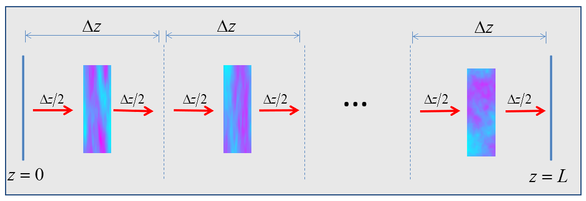
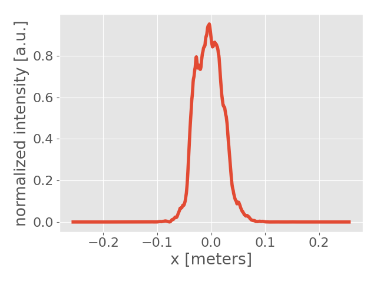
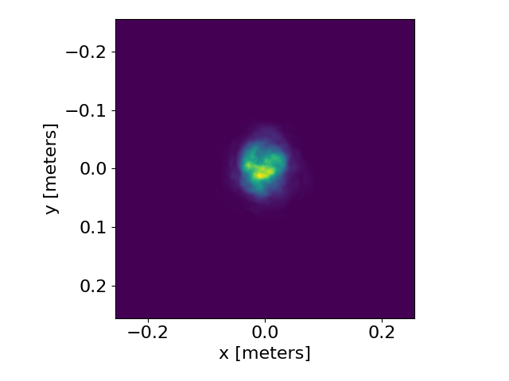
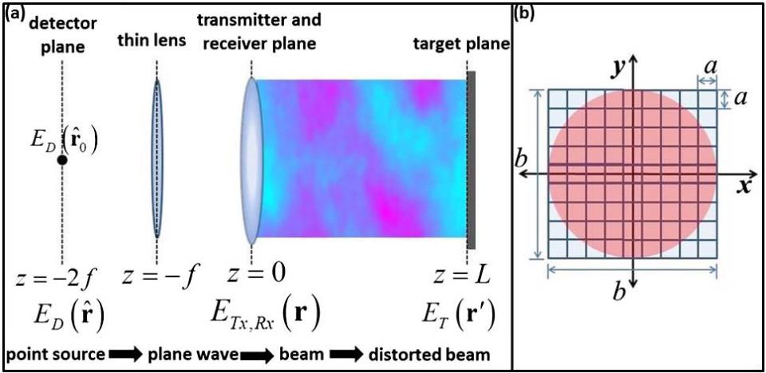
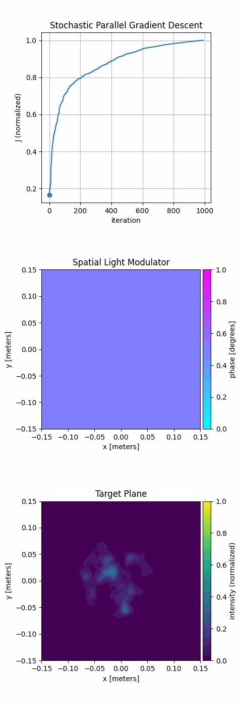

# Python Library for Atmospheric Laser Propagation

`pyalp` is a python library to facilitate experiments involving the propgation
of laser beams thorugh atmospheric turbulence. The library uses the split step
phase screen approximation described in [1], where flucutations in the
refractive index of air are conceptualized as two dimensional phase screens.
Propagation through the atmosphere consists of alternating between propagation
through a homogenous medium and applying the accummulated phase distortions for
the correpsonding distance. The split step phase screen approximation is
depicted in the figure below.



The `pyalp` library can be used to reproduce numerical experiments on enhanced
backscatter in [2] and reproduce the simulation of focusing a laser beam through
atmospheric turbulence onto a remote rough surface published in [3]. See the
`experiments/` directory for the appropriate scripts.

## Installation

A pip installable wheel distribution is created during the `pkg` stage of the
docker build. Alternatively, the wheel file can be downloaded from the
[releases](https://github.com/wnels/pyalp/releases) section of github. The
`pyalp` library and all dependencies can installed using pip:

```
pip install pyalp-0.1.0-py3-none-any.whl
```

## Quick Start

A simple atmospheric laser propagation simulation using the `pyalp` library is
shown below.

```python
import pyalp

grid = pyalp.grids.grid_2d(x_delta=2.5e-4, count=2048)
beam = pyalp.beams.gaussian(grid, spot_size=0.05, wavelength=1e-6, radius=0.2)
turb = pyalp.phase_screen.kolmogorov(grid, cn2=1e-15)
channel = pyalp.atmosphere.channel(turb, distance=2000, phase_screen_count=10)
channel.forward(beam, progress_bar=True)
```

The results of the simulation can be visualized using `pyalp`:

```python
pyalp.display.plot1d(beam.get_intensity(), grid.x_vector)
pyalp.display.plot2d(beam.get_intensity(), grid.x_vector)
```




## Experiments

### Using an incoherent target return to adaptively focus through atmospheric turbulence





## References

[1] W. Nelson, J. P. Palastro, C. C. Davis and P. Sprangle, “Propagation of Bessel and Airy beams through atmospheric turbulence,” J. Opt. Soc. Am. A, 31(3), 603-609 (2014)

[2] W. Nelson, J. P. Palastro, C. Wu, and C. C. Davis, “Enhanced backscatter of optical beams reflected in turbulent air,” J. Opt. Soc. Am. A, 32(7), 1371-1378 (2015)

[3] W. Nelson, J. P. Palastro, C. Wu, and C. C. Davis, “Using an incoherent target return to adaptively focus through atmospheric turbulence”, Optics Letters, 41 (6), (2016)